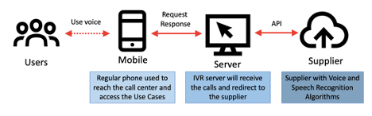

The application's architecture is composed of three main parts: the user side,
which consists of a mobile device (including feature phones); the server side,
which is developed by our team to create user sessions; and the supplier, which
contains the biometric platform with voice/speech recognition algorithms.

